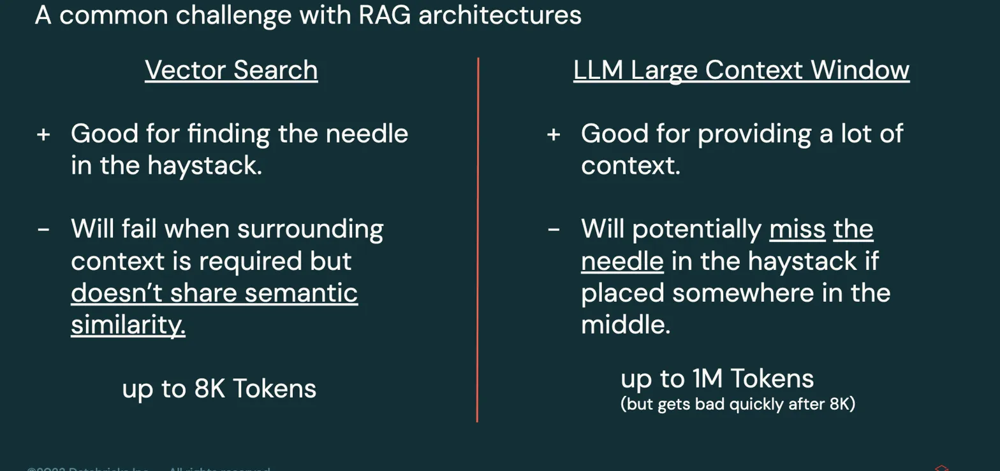
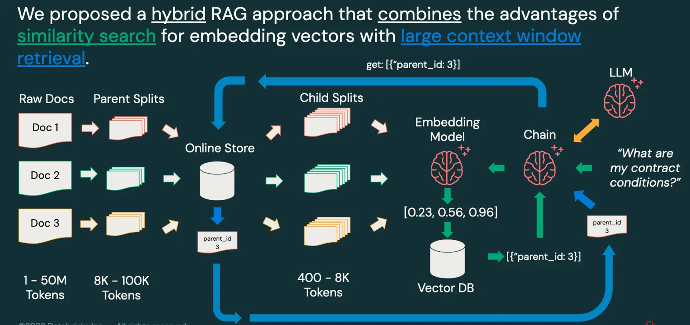

# Copilot RAG Solution Accelerator for Large Documents

## Table of Contents
* [Why a Copilot for Large Documents?](#why-a-copilot-for-large-documents)
* [About this Solution Accelerator](#about-this-solution-accelerator)
* [Vector Databases vs Large Context Windows](#vector-databases-vs-large-context-windows)
* [Structure](#structure)
* [Architecture](#architecture)
* [Disclaimer](#disclaimer)
* [Outlook](#outlook)

## Why a Copilot for Large Documents?
Many industries possess extensive knowledge bases but struggle to leverage that knowledge systematically. LLMs with access to this knowledge have proven to be excellent solutions to this business challenge. However, many current low-code or no-code solutions struggle to provide comprehensive answers when documents are large and complex. We propose a solution that combines large context window retrieval with vector search to yield superior results in verticals such as:

1. Finance (contracts)
2. Manufacturing (technical manuals)
3. Public Service (legal papers)

### Vector Databases vs Large Context Windows

Our hybrid approach leverages the strengths of both techniques, providing a robust and flexible solution for handling large documents and specific queries that need to find the proverbial needle in the haystack.

### Architecture

Our proposed solution architecture combines the power of vector databases and large context windows to create a robust and efficient RAG system:

1. Document Ingestion: Large documents are processed and split into manageable parent chunks.
2. Vector Embedding: Parent chunks are further broken down into a chunk size well-suited for embeddings and vector databases.
3. Query Processing: User queries are embedded, and the vector database searches for semantically similar content.
4. Context Assembly: The vector database returns the ID of the parent document from which the semantically similar content was derived.
5. Prompt Creation: The parent document is retrieved from the database, and the final prompt is generated.
6. Response Generation: The LLM generates a response based on the provided context and user query.
7. Result Presentation: The generated response is presented to the user through the front-end interface.

This architecture allows for efficient retrieval of relevant information from large document collections while maintaining the ability to process and understand complex relationships within the retrieved context.

## About this Solution Accelerator
This project contains code to deploy a RAG (Retrieval Augmented Generation) solution on Databricks. It combines the advantages of Vector Search with the large window capability of recent LLMs (Large Language Models). This solution is optimal for scenarios requiring large context windows to answer open questions while maintaining the ability to find specific information within vast datasets.

### Structure
The following notebooks will create a Hybrid RAG Chatbot with a Review UI and a Front-End for end-user interaction:

* [01-Config](./01-Config.py) - Create the configuration for the project. **Please adjust parameters here!**
* [02-Create-Tables](./02-Create-Tables.py) - Creates the necessary tables.
* [03-Create-Document-Job](./03-Create-Document-Job.py) - Creates a job that can be scheduled or triggered to update tables and index.
* [03b-Load-Documents](./03b-Load-Documents.py) - Notebook that runs as a job to update tables and index.
* [04-Create-Endpoints](./04-Create-Endpoints.py) - Creates RAG-Chain, Endpoints, and Review UI.
* [05-Deploy-Frontend-Lakehouse-App](./05-Deploy-Frontend-Lakehouse-App.py) - Creates a Gradio Front-End App and deploys it as a Lakehouse App (Private Preview)

### Prerequistes
1. A Databricks Workspace with Unity Catalog, Serverless and dlt enabled.
2. Version Control System (can be private corporate vcs) with access to the Databricks Workspace.
   

### How to use:
Watch the following videos for a complete guide to the rollout:

#### [01-Config](./01-Config.py)
This solution leverages a .yaml configuration file to allow for easy updates and adaptation of the solution. 
* Step 1: Ask your workspace admin to create a Service Principal (SP) and put the SP credentials in a Databricks Secret that your current user has the privilege to access.
* Step 2: Fork this repository and put it into your own version control system (VCS). Also make sure to use the release branch, as we roll out stable solutions there.
* Step 3: Clone this repository into your Databricks Workspace. 
* Step 4: Attach a cluster and update the catalog, schema, and other parameters in the notebook.
* Step 5: Execute the notebook to generate `rag_chain_config.yaml` in the local path. 

#### [02-Create-Tables](./02-Create-Tables.py)
This notebook will generate the required tables in Unity Catalog (UC). 
* Step 1: Run the notebook to generate tables in the specified catalog and schema.
* Step 2: In the Workspace, check under Catalog if documents, parent_splits, and child_splits Delta Tables have been generated. Also check for the index and online tables.
* Step 3: Check under Volumes if there is a `source_data` and a `checkpoints` Volume.
* Step 4: Add the new folder `text` to the source_data Volume and upload text documents to that folder.

#### [03-Create-Document-Job](./03-Create-Document-Job.py) 
This notebook is used to create a triggered job that will run when new files have been added to the `text` folder of the `source_data` Volume. When the job starts, it will only add new documents to the solution. Please be aware that removing documents from the `text` folder will not erase these documents from the RAG solution. Also be aware that different file names with the same content will duplicate content in the RAG solution. 
* Step 1: Update parameters about your version control system and path to forked repository.
* Step 2: Add the user name (e-mail) that is running the job. It is recommended to add the Service Principal as the user for the job. But be aware that this job is running from the forked git repository and that you need to add the git credentials to the Service Principal (reach out to Workspace Admin) first.
* Step 3: Run the notebook and check if the job has been created under workflows. Use the pipeline that is shown as output to find the job in workflows. You can check if the job is working properly by adding a new text file to the `text` folder. This should start the job, and when completed, you will be able to find the content in documents, parent_splits, and child_splits tables.  

#### [03b-Load-Documents](./03b-Load-Documents.py)
This notebook is used by [03-Create-Document-Job](./03-Create-Document-Job.py) as the actual update code that is run when the update pipeline is triggered. 

#### [04-Create-Endpoints](./04-Create-Endpoints.py)
This notebook contains the code for creating the parent document endpoint and the final RAG chain endpoint with Q&A or conversational chain. 

* Step 1: Decide which chain you want to use. It is recommended to use the conversational chain as this chain provides the best user experience. Put the code block of the other chain behind comments or delete the cell.
* Step 2: Run the notebook and check that both Endpoints have been created under Serving. **Please be aware** The initial creation of the Endpoints can take up to 30 minutes because images need to be built from scratch. Subsequent creation of new model versions will be quicker.
* Step 3: Once Endpoints are created, check if Endpoints will retrieve content by running the example that is shown when navigating to the agents Endpoint and clicking on "Query Endpoint".

#### [05-Deploy-Frontend-Lakehouse-App](./05-Deploy-Frontend-Lakehouse-App.py)
This notebook contains an example of a conversational Gradio App Front-End with filter. You can try Lakehouse Apps to host the App, but please be aware that this feature is still in Private Preview and not fully stable yet. We recommend deploying the Gradio App on your own hosting service for now.

## Disclaimer 
This solution is not intended for B2C use cases or in scenarios where the Copilot response is used without supervision.

## Outlook
We plan to add the following features in the near future:

* Judge Evaluation Workflows
* Monitoring Dashboard
* Multi-Modal Document Support
* Deployment as Databricks Asset Bundles (DAB)
